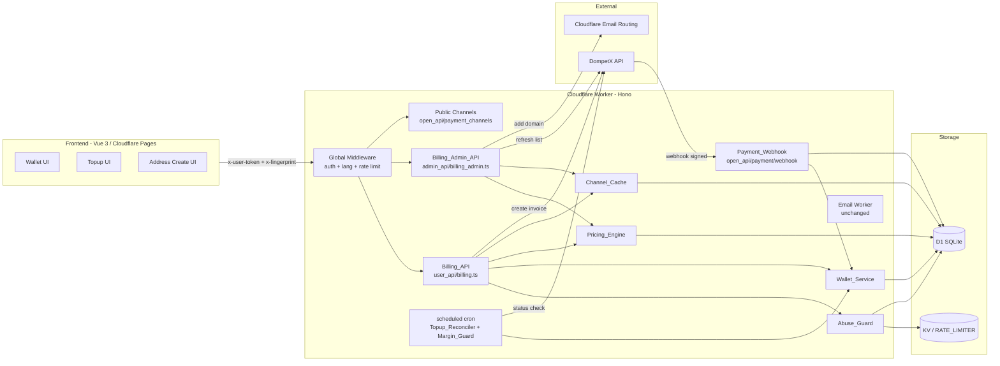
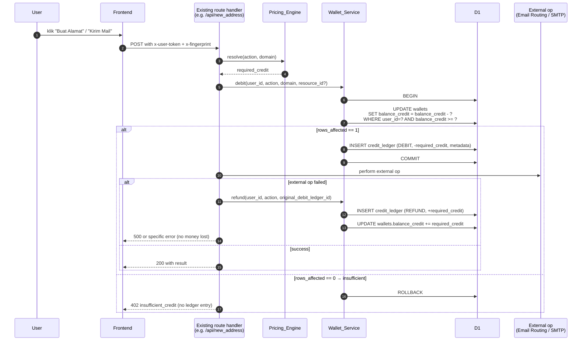

# Design Document — SaaS Top-up Billing (`automation.my.id`)

## Overview

Fitur ini mengubah produk `cloudflare_temp_email` menjadi SaaS berbasis saldo kredit (top-up) yang berjalan di Cloudflare Workers (Hono) + D1 + Vue 3. Pengguna melakukan top-up rupiah via agregator **DompetX**, nominal dikonversi menjadi **credit** internal (`1 credit = Rp100`), lalu setiap aksi berbayar (membuat address, kirim mail, forward) mendebet kredit sesuai **pricing rule** yang bergantung pada TLD domain dan tipe aksi.

Tujuan desain:

- **Correctness & auditability** — saldo selalu konsisten dengan ledger (append-only), tidak ada saldo negatif, webhook 100% idempoten.
- **Operability tanpa redeploy** — pricing, bonus, dan margin guard disimpan di tabel `pricing_rules` yang dibaca Pricing_Engine dengan cache TTL 60 detik.
- **Backward compatibility** — jalur existing (`/api/*`, `/admin/*`, `/open_api/*`, WebAuthn, OAuth2, Email Routing, SMTP/IMAP proxy) tidak diubah. Endpoint billing ditambahkan sebagai modul baru di bawah `user_api/`, `admin_api/`, dan `open_api/`.
- **Safety & abuse control** — rate limit per user + fingerprint + IP guard pada endpoint top-up; semua secret DompetX via `wrangler secret` binding.
- **i18n** — menambah locale `id` (Bahasa Indonesia) berdampingan dengan `en`/`zh` yang sudah ada; default locale `id` untuk domain `automation.my.id`.

### Design decisions & rationale

| Decision | Rationale |
|---|---|
| Credit sebagai unit internal (`1 credit = Rp100`) | Integer-only math, menghindari presisi floating point, dan konsisten dengan invariant `SUM(ledger) = wallet.balance_credit`. |
| Single-source-of-truth: `credit_ledger` append-only + `wallets.balance_credit` snapshot | Ledger mendukung audit & rekonstruksi; snapshot mempercepat pembacaan saldo (O(1)) dan guard `CHECK (balance_credit >= 0)` di level DB. |
| Idempotency key = `UNIQUE(invoice_id)` + `UNIQUE(provider_reference)` + `credit_ledger.idempotency_key` | Tiga lapisan pertahanan: transisi state `pending → paid` atomik via `UPDATE … WHERE status='pending'`, plus unique index sebagai safety net jika D1 retry. |
| Pricing di tabel `pricing_rules` versioned (`rule_key`, `rule_value_json`, `version`, `is_active`) | Memungkinkan admin mengubah tanpa redeploy, sekaligus mempertahankan riwayat lewat `is_active=false` untuk audit. |
| Domain weight ditentukan dari `domain_suffix` (TLD), bukan hard-code per domain | Skala ke domain baru tanpa perubahan kode; default `.com`=4, non-`.com`=1 dengan guard `.com ≤ 5`. |
| Reconciler lewat scheduled Worker (cron) | Tidak ada DLQ tambahan; memakai infrastruktur `scheduled` yang sudah ada. |
| Frontend tidak pernah memegang secret DompetX | User hanya menerima URL checkout yang di-generate backend; webhook 100% server-to-server. |

### Glossary (singkat, lihat `requirements.md` untuk detail)

Wallet, Credit, Ledger, Topup, Channel, Gross Amount, Fee, Idempotency Key, Pricing Rule, Domain Weight, High-cost Action, Bonus Threshold/Rate, Margin Guard, Fingerprint, Abuse_Guard, Audit_Log.

## Architecture

### High-level diagram



### Module placement (aligned with existing repo)

| Module | File | Auth |
|---|---|---|
| Billing_API (user) | `worker/src/user_api/billing.ts` | `x-user-token` via existing `/user_api/*` middleware |
| Billing_Admin_API | `worker/src/admin_api/billing_admin.ts` | `x-admin-auth` via existing `/admin/*` middleware |
| Payment_Webhook | `worker/src/open_api/payment_webhook.ts` | No auth, HMAC signature + timestamp anti-replay |
| Public channels | `worker/src/open_api/payment_channels.ts` | No auth, safe read-only |
| Wallet_Service | `worker/src/billing/wallet_service.ts` | Internal |
| Pricing_Engine | `worker/src/billing/pricing_engine.ts` | Internal |
| Channel_Cache | `worker/src/billing/channel_cache.ts` | Internal |
| Abuse_Guard | `worker/src/billing/abuse_guard.ts` | Internal |
| Topup_Reconciler | `worker/src/billing/reconciler.ts` invoked from `worker/src/scheduled.ts` | Cron |
| DompetX client | `worker/src/billing/dompetx_client.ts` | Internal |
| Models & types | `worker/src/models/billing.ts` + `worker/src/types.d.ts` additions | — |
| i18n `id` | `worker/src/i18n/id.ts` + `frontend/src/i18n/id.js` | — |
| Frontend views | `frontend/src/views/wallet/*.vue` + router entry | — |

Integrasi ke `worker/src/worker.ts` hanya menambahkan `app.route('/', billingAdminApi)`, `app.route('/', paymentWebhookApi)`, dan daftar route di `user_api/index.ts` + `open_api/` sesuai pola existing. Middleware `/user_api/*` yang ada sudah mem-validasi JWT user; Billing_API tidak perlu middleware baru.

### Request flow — Top-up lifecycle

```mermaid
sequenceDiagram
  autonumber
  participant U as User (Browser)
  participant F as Frontend Wallet UI
  participant B as Billing_API
  participant AG as Abuse_Guard
  participant CC as Channel_Cache
  participant DPX as DompetX
  participant WH as Payment_Webhook
  participant WS as Wallet_Service
  participant DB as D1

  U->>F: Pilih preset / custom nominal
  F->>B: POST /user_api/topup/quote {nominal}
  B->>AG: check rate limit (30/min/user)
  B->>CC: filter channels by nominal
  B-->>F: [{channel_code, fee, gross_amount, fee_bearer}]
  U->>F: Pilih channel + klik Bayar
  F->>B: POST /user_api/topup/create {nominal, channel_code, fingerprint}
  B->>AG: rate limit 5/10min + fingerprint + IP guard
  B->>DB: INSERT topup_transactions (status=pending, idempotency_key)
  B->>DPX: createInvoice(amount, channel, webhook_url)
  DPX-->>B: {invoice_id, checkout_url, provider_reference}
  B->>DB: UPDATE topup_transactions SET invoice_id, provider_reference
  B-->>F: {checkout_url, invoice_id}
  F->>U: Redirect / iframe ke checkout_url
  U->>DPX: Bayar
  DPX->>WH: POST /open_api/payment/webhook/dompetx (signed)
  WH->>WH: verify HMAC + timestamp
  WH->>DB: BEGIN; UPDATE topup_transactions<br/>SET status='paid'<br/>WHERE invoice_id=? AND status='pending'
  alt rows_affected == 1 (transisi pertama)
    WH->>WS: credit(user_id, amount, invoice_id)
    WS->>DB: INSERT credit_ledger (TOPUP, +floor(amount/100))
    WS->>DB: if amount>=bonus_threshold → INSERT credit_ledger (BONUS, +bonus_credits)
    WS->>DB: UPDATE wallets.balance_credit = balance + total_delta
    DB-->>WH: COMMIT
    WH-->>DPX: 200 OK
  else rows_affected == 0 (replay / already terminal)
    WH-->>DPX: 200 OK (idempotent, tanpa ledger baru)
  end
  F->>B: poll GET /user_api/topup/history (≤ 2 menit)
  B-->>F: status=paid, saldo baru
```

### Request flow — Paid action (create_address / send_mail / forward_mail)



### Secret & binding summary

Secrets via `wrangler secret put`:

- `DOMPETX_API_KEY`, `DOMPETX_API_SECRET`, `DOMPETX_WEBHOOK_SECRET`
- `CLOUDFLARE_EMAIL_ROUTING_TOKEN` (scope: `Email Routing:Edit`)

`wrangler.toml` additions:

- `[vars]` — `BILLING_ENABLED = true`, `BILLING_LAUNCH_AT = "2026-XX-XX"`, `DEFAULT_LANG = "id"` (untuk `automation.my.id`).
- Reuse `[[d1_databases]] binding="DB"` dan `[[kv_namespaces]] binding="KV"` existing.
- `[[unsafe.bindings]] RATE_LIMITER` existing dipakai untuk limit endpoint billing (atau tambah namespace kedua `BILLING_RATE_LIMITER` jika volume tinggi).
- `[triggers] crons = [ "*/5 * * * *" ]` untuk Topup_Reconciler.

## Components and Interfaces

### Wallet_Service (`worker/src/billing/wallet_service.ts`)

Internal service, bukan HTTP API. Dipanggil oleh Billing_API, Payment_Webhook, Topup_Reconciler, dan handler aksi berbayar.

```ts
export interface WalletService {
  // Lazy-create wallet if missing. Returns current snapshot.
  ensureWallet(userId: number): Promise<WalletRow>;

  // Atomic: check balance >= credits, decrement, append DEBIT ledger in one D1 batch.
  // Returns { ledgerId } on success, or throws InsufficientCreditError.
  debit(args: {
    userId: number;
    credits: number;                  // positive integer
    actionKey: string;                // e.g. "create_address"
    domain: string;
    resourceId?: string | number;
    idempotencyKey?: string;          // optional; for external-triggered debits
  }): Promise<{ ledgerId: number; newBalance: number }>;

  // Compensating ledger for a prior DEBIT; +credits. Idempotent by refund_of_ledger_id.
  refund(args: {
    userId: number;
    credits: number;
    refundOfLedgerId: number;
    reason: string;
  }): Promise<{ ledgerId: number; newBalance: number }>;

  // Credit for paid topup + optional bonus, all in one D1 batch.
  // Idempotent by idempotencyKey (invoice_id). If already credited, no-op.
  creditTopup(args: {
    userId: number;
    amountIdr: number;                // gross nominal excluding fee (see rule 4.6-4.8)
    creditIdrRate: number;            // typically 100
    bonusThresholdIdr: number;
    bonusRatePercent: number;
    invoiceId: string;                // idempotency key
  }): Promise<{ topupLedgerId: number; bonusLedgerId?: number; newBalance: number }>;

  // Admin-driven manual adjust. ADJUST ledger type. Rejects if resulting balance < 0.
  adjust(args: {
    adminId: number;
    userId: number;
    creditDelta: number;              // can be negative
    reason: string;
  }): Promise<{ ledgerId: number; newBalance: number }>;

  getSnapshot(userId: number): Promise<WalletRow>;
  listLedger(args: { userId: number; limit: number; cursor?: string }): Promise<LedgerPage>;
}
```

Implementation note — **all mutation methods MUST use a single `db.batch([...])`** (D1 statement batch) so that balance guard + ledger insert commit atomically. Balance guard is enforced both by:

1. Conditional `UPDATE wallets SET balance_credit = balance_credit - ? WHERE user_id = ? AND balance_credit >= ?` and inspecting `rows_affected`.
2. `CHECK (balance_credit >= 0)` on the `wallets` table as second line of defense.

### Pricing_Engine (`worker/src/billing/pricing_engine.ts`)

```ts
export interface PricingEngine {
  // Returns required credit for a given action+domain, using cached rules.
  resolve(args: { actionKey: string; domain: string }): Promise<number>;

  // Typed accessors for non-per-action rules.
  getNumber(ruleKey: RuleKey): Promise<number>;
  getObject<T>(ruleKey: RuleKey): Promise<T>;

  // Bump cache-bust token; used by admin PUT.
  invalidateCache(): void;

  // For preview endpoints: all active domains with per-action costs.
  listDomainCosts(actionKey: string): Promise<Array<{
    domain: string; domainSuffix: string; domainWeight: number; creditCost: number;
  }>>;
}

export type RuleKey =
  | 'domain_weight_com' | 'domain_weight_default'
  | 'action_cost_create_address'
  | 'action_cost_send_mail'       // high-cost: constant credits, NOT weight * X
  | 'action_cost_forward_mail'    // high-cost: constant credits
  | 'credit_idr_rate'
  | 'bonus_threshold_idr' | 'bonus_rate_percent'
  | 'min_topup_idr'
  | 'margin_guard_auto' | 'margin_guard_target_percent'
  | 'grandfather_period_days';
```

**Resolution algorithm for `resolve(action, domain)`:**

```
suffix = extractSuffix(domain)             // ".com" | ".web.id" | ".my.id" | ...
isCom  = suffix == ".com"
weight = isCom ? domain_weight_com : domain_weight_default
switch (action):
  case "create_address":
    return weight * action_cost_create_address   // default: 4*1=4 for .com, 1 for others
  case "send_mail":
    // high-cost: constant floor, then apply weight as multiplier on TOP of floor
    return max(action_cost_send_mail, weight * action_cost_send_mail_per_weight?)
    // default simple: return action_cost_send_mail (constant, not domain-weighted)
  case "forward_mail":
    return action_cost_forward_mail
```

The design fixes the high-cost actions (`send_mail`, `forward_mail`) as **constant credits** (not multiplied by weight) per requirement 6.5. `create_address` uses the weight × `action_cost_create_address` formula. This keeps `send_mail`/`forward_mail` predictable across domains while still allowing `.com` create_address to be priced higher.

**Cache** — a module-level map `Map<cacheKey, { value, expiresAt }>` with TTL 60s. Cache key = `ruleKey`. Invalidate on `PUT /admin/billing/pricing_rules`. Because Cloudflare Workers run many isolates, this is a per-isolate cache and admin updates propagate within 60s without fan-out.

### Channel_Cache (`worker/src/billing/channel_cache.ts`)

```ts
export interface ChannelCache {
  listPublic(nominal?: number): Promise<PaymentChannel[]>;   // for /open_api
  listForQuote(nominal: number): Promise<PaymentChannelQuote[]>; // includes fee/gross
  refresh(): Promise<{ count: number }>;                     // admin-triggered
}

export interface PaymentChannel {
  channel_code: string; name: string; group: string;
  min: number; max: number | null;
  fee_type: 'percentage' | 'fixed' | 'mixed';
  fee_value: number; fee_fixed: number;
  fee_bearer: 'customer' | 'merchant';
  is_active: boolean;
  icon_url?: string;
}

export interface PaymentChannelQuote extends PaymentChannel {
  estimated_fee: number;   // in IDR
  gross_amount: number;    // nominal + fee if fee_bearer == customer, else nominal
}
```

Cache TTL 10 menit dengan stale-while-revalidate: endpoint public mem-return data existing lalu schedule `ctx.waitUntil(refreshIfStale())`. Admin `POST /admin/billing/channels/refresh` force-refresh synchronous.

### Abuse_Guard (`worker/src/billing/abuse_guard.ts`)

```ts
export interface AbuseGuard {
  checkTopupQuote(c: Context): Promise<void>;   // 30/min/user
  checkTopupCreate(c: Context): Promise<void>;  // 5/10min/user + IP new-user guard + fingerprint
  requireFingerprint(c: Context): string;       // throws 400 fingerprint_required
}
```

Storage strategy — KV namespace `BILLING_RL` (reuses existing `KV` binding with prefix `rl:`):

- Per-user quote counter: `rl:quote:{user_id}:{bucket_minute}` TTL 60s.
- Per-user create counter: `rl:topup:{user_id}:{bucket_10min}` TTL 600s.
- IP new-user bucket: `rl:ipnew:{ip}:{bucket_hour}` TTL 3600s, key stores JSON `{uniqueUserIds: string[]}`; >10 unique → block `rl:ipblock:{ip}` TTL 3600s, write `audit_logs` entry.
- Fingerprint is a required `x-fingerprint` header; Billing_API hashes it server-side (`SHA-256`) before persisting to `topup_transactions.fingerprint_hash` and `rl:*` keys.

### Billing_API endpoints (`worker/src/user_api/billing.ts`)

All routes are subject to existing `/user_api/*` JWT middleware.

| Method | Path | Body / Query | Response |
|---|---|---|---|
| GET | `/user_api/wallet` | — | `{ balance_credit, balance_idr_ref, updated_at }` |
| GET | `/user_api/wallet/ledger` | `?limit=&cursor=` | `{ items: LedgerEntry[], next_cursor }` |
| GET | `/user_api/billing/domains` | — | `[{ domain, domain_suffix, credit_cost }]` (for `create_address`) |
| POST | `/user_api/topup/quote` | `{ nominal }` | `[{ channel_code, name, fee_bearer, estimated_fee, gross_amount, bonus_hint }]` |
| POST | `/user_api/topup/create` | `{ nominal, channel_code }` | `{ invoice_id, checkout_url, expires_at, amount, fee, gross_amount }` |
| GET | `/user_api/topup/history` | `?limit=&cursor=&status=` | `{ items: TopupRow[], next_cursor }` |

Error codes (mapped to HTTP + i18n message):

| Code | HTTP | When |
|---|---|---|
| `unauthenticated` | 401 | no/invalid `x-user-token` |
| `insufficient_credit` | 402 | balance < required |
| `domain_not_allowed` | 400 | domain not in `allowed_domains` |
| `nominal_below_minimum` | 400 | `nominal < min_topup_idr` |
| `channel_not_eligible` | 400 | channel inactive or outside min/max |
| `fingerprint_required` | 400 | missing `x-fingerprint` |
| `rate_limited` | 429 | Abuse_Guard |
| `duplicate_invoice` | 409 | invoice_id already exists |
| `unknown_action` | 400 | pricing rule missing |

### Billing_Admin_API endpoints (`worker/src/admin_api/billing_admin.ts`)

All routes subject to existing `/admin/*` middleware (`x-admin-auth`).

| Method | Path | Body / Query | Response |
|---|---|---|---|
| GET | `/admin/billing/pricing_rules` | — | `[{ rule_key, rule_value_json, version, is_active, updated_at }]` |
| PUT | `/admin/billing/pricing_rules` | `{ rule_key, rule_value_json }` | `{ rule_key, new_version }` |
| GET | `/admin/billing/topup_transactions` | `?status=&user_id=&from=&to=&limit=&cursor=` | `{ items, next_cursor }` |
| GET | `/admin/billing/topup_transactions/:id` | — | full row incl `raw_payload` |
| POST | `/admin/billing/channels/refresh` | — | `{ count, fetched_at }` |
| POST | `/admin/billing/credit_adjust` | `{ user_id, credit_delta, reason }` | `{ ledger_id, new_balance }` |
| GET | `/admin/billing/kpi` | `?from=&to=` | KPI object |
| GET | `/admin/billing/domains` | — | `[{ domain, is_active, created_at }]` |
| POST | `/admin/billing/domains` | `{ domain }` | `{ domain, is_active }` |
| DELETE | `/admin/billing/domains/:domain` | — | `{ ok: true }` |

Admin PUT `pricing_rules` validation:

- `domain_weight_com` ∈ `[1, 5]`. Reject 400 `margin_guard_violation` otherwise.
- `min_topup_idr` ≥ 10000. Reject 400 `min_topup_violation` otherwise.
- `credit_idr_rate` ≥ 1 and integer. Reject 400 otherwise.
- `bonus_rate_percent` ∈ `[0, 100]`.

Each `PUT` runs as a D1 batch:
```
UPDATE pricing_rules SET is_active = 0 WHERE rule_key = ? AND is_active = 1;
INSERT INTO pricing_rules(rule_key, rule_value_json, version, is_active) VALUES (?, ?, (SELECT COALESCE(MAX(version),0)+1 FROM pricing_rules WHERE rule_key = ?), 1);
INSERT INTO audit_logs(admin_id, event_type, rule_key, old_value, new_value, created_at) VALUES (...);
```

### Payment_Webhook (`worker/src/open_api/payment_webhook.ts`)

```
POST /open_api/payment/webhook/dompetx
Headers:
  X-DompetX-Signature: hex(HMAC_SHA256(secret, timestamp + "." + raw_body))
  X-DompetX-Timestamp: unix_seconds  (reject if |now - ts| > 300s)
Body: JSON { invoice_id, provider_reference, status, amount, fee, channel, paid_at?, raw }
```

Processing (pseudo):

```
1. Read raw body; parse headers; verify HMAC (timingSafeEqual) and |now - ts| ≤ 300s.
   Fail → 401 (no state change). Increment audit counter for webhook_mismatch_rate.
2. Parse JSON. If status ∉ {paid, failed, expired} → 200 no-op.
3. Case status == paid:
   BEGIN BATCH:
     UPDATE topup_transactions
       SET status='paid', paid_at=?, provider_reference=COALESCE(provider_reference, ?),
           raw_payload=?  -- masked
       WHERE invoice_id = ? AND status = 'pending';
     -- check rows_affected via RETURNING or follow-up SELECT
   COMMIT
   IF rows_affected == 1:
     call Wallet_Service.creditTopup({ userId, amountIdr, ..., invoiceId })
       -- this itself is idempotent by invoice_id, but we reach here only on first transition
   ELSE:
     SELECT status FROM topup_transactions WHERE invoice_id = ?;
     IF already 'paid' → 200 OK (idempotent replay)
     IF terminal non-paid → 200 OK (ignore out-of-order event)
4. Case status in {failed, expired}:
   UPDATE topup_transactions SET status=? WHERE invoice_id=? AND status='pending';
   Always 200 OK.
5. Always persist masked raw_payload for audit (mask 'signature', 'api_key' keys).
```

**Idempotency guarantees**:

- Primary: `UPDATE … WHERE status='pending'` — only one racer succeeds, others get `rows_affected=0` and become no-ops.
- Secondary: `UNIQUE(invoice_id)` and `UNIQUE(provider_reference)` on `topup_transactions`.
- Tertiary: `credit_ledger` gets an optional `idempotency_key` column (for `TOPUP`/`BONUS` entries: value = `invoice_id`); `UNIQUE(idempotency_key, type)` prevents double-insert even if the first two guards were bypassed.

### Public channels (`worker/src/open_api/payment_channels.ts`)

```
GET /open_api/payment_channels?nominal=50000
→ [{ channel_code, name, group, min, max, fee_type, fee_value, fee_fixed, fee_bearer, is_active, icon_url }]
```

Strips any sensitive fields (`api_key`, `signature_secret`, `raw`). Delegates to `Channel_Cache.listPublic(nominal)`.

### Topup_Reconciler (`worker/src/billing/reconciler.ts`)

Runs via `scheduled()` every 5 minutes. Steps:

```
1. SELECT * FROM topup_transactions
     WHERE status='pending'
       AND created_at < datetime('now', '-' || expiry_minutes || ' minutes')
     LIMIT 100;
2. For each row:
   a. Call DompetX status API with invoice_id.
   b. Map provider status:
      - paid    → delegate to Wallet_Service.creditTopup (idempotent by invoice_id),
                  set topup_transactions.status='paid'.
      - failed  → set status='failed'.
      - expired → set status='expired'.
      - unknown → leave pending, log.
3. Aggregate KPI counters into a stats table (or compute on-the-fly during KPI query).
4. If margin_guard_auto=true and net_margin_monthly<55%:
     current = pricing_rules['domain_weight_com']
     if current < 5: set +1; write audit_log type=auto_margin_guard.
```

### Frontend_Wallet_UI

Pages (`frontend/src/views/wallet/`):

- `WalletHome.vue` — saldo + last 10 ledger entries + tombol Top-up.
- `Topup.vue` — preset nominal + custom input, panel channels (dari `/user_api/topup/quote`), summary + tombol Bayar.
- `TopupHistory.vue` — list transaksi + filter status.
- `Ledger.vue` — paged ledger dengan cursor.

State additions (`frontend/src/store/index.js`): `wallet = { balance_credit, updated_at }`. Auto-refresh setelah create_address dan send_mail melalui listener response 402.

Address create form (`frontend/src/views/...`) sudah menampilkan daftar domain; cukup tambah kolom `credit_cost` per domain dari `/user_api/billing/domains` dan label "Bonus +5%" di preset yang memenuhi threshold.

Fingerprint diambil dari `@fingerprintjs/fingerprintjs` (sudah dipakai di repo atau tambah dependency baru). Dikirim via header `x-fingerprint` untuk semua request `/user_api/topup/*` dan paid-action routes. Frontend TIDAK pernah menerima secret; hanya `checkout_url` + `invoice_id`.

### DompetX client (`worker/src/billing/dompetx_client.ts`)

Thin wrapper around `fetch` with:

- `createInvoice({ amount, channel_code, fee_bearer, metadata, webhook_url, return_url })`
- `getInvoiceStatus(invoice_id)`
- `listChannels()`
- `verifyWebhookSignature(rawBody, timestamp, signatureHex)` (constant-time compare)

Auth headers use `DOMPETX_API_KEY` + signature over body with `DOMPETX_API_SECRET`. Retries: 2x with 250ms/750ms jittered backoff on 5xx; never on 4xx.

## Data Models

### D1 schema additions (migration file: `db/2026-XX-XX-billing-wallet.sql`)

```sql
-- Wallet — one per user. Created lazily on first wallet read, or eagerly at register.
CREATE TABLE IF NOT EXISTS wallets (
  user_id         INTEGER PRIMARY KEY REFERENCES users(id),
  balance_credit  INTEGER NOT NULL DEFAULT 0 CHECK (balance_credit >= 0),
  balance_idr_ref INTEGER NOT NULL DEFAULT 0,            -- informational running idr ref
  created_at      DATETIME NOT NULL DEFAULT CURRENT_TIMESTAMP,
  updated_at      DATETIME NOT NULL DEFAULT CURRENT_TIMESTAMP
);

-- Append-only credit ledger. No row is ever updated or deleted by normal flow.
CREATE TABLE IF NOT EXISTS credit_ledger (
  id               INTEGER PRIMARY KEY AUTOINCREMENT,
  user_id          INTEGER NOT NULL REFERENCES users(id),
  type             TEXT    NOT NULL
                     CHECK (type IN ('TOPUP','DEBIT','ADJUST','BONUS','REFUND')),
  credit_delta     INTEGER NOT NULL
                     CHECK (
                       (type='DEBIT'  AND credit_delta < 0) OR
                       (type IN ('TOPUP','BONUS','REFUND') AND credit_delta > 0) OR
                       (type='ADJUST' AND credit_delta != 0)
                     ),
  idr_ref          INTEGER,
  metadata         TEXT,            -- JSON: {action_key, domain, resource_id, refund_of?, admin_id?, invoice_id?}
  idempotency_key  TEXT,            -- e.g. invoice_id for TOPUP/BONUS, refund_of_ledger_id for REFUND
  created_at       DATETIME NOT NULL DEFAULT CURRENT_TIMESTAMP
);

CREATE INDEX IF NOT EXISTS idx_credit_ledger_user_created
  ON credit_ledger(user_id, created_at DESC);
CREATE UNIQUE INDEX IF NOT EXISTS idx_credit_ledger_idem_type
  ON credit_ledger(idempotency_key, type) WHERE idempotency_key IS NOT NULL;

-- Top-up transactions with DompetX.
CREATE TABLE IF NOT EXISTS topup_transactions (
  id                  INTEGER PRIMARY KEY AUTOINCREMENT,
  user_id             INTEGER NOT NULL REFERENCES users(id),
  invoice_id          TEXT    NOT NULL UNIQUE,
  provider_reference  TEXT    UNIQUE,
  channel_code        TEXT    NOT NULL,
  amount              INTEGER NOT NULL,         -- IDR nominal (kredit = floor(amount/credit_idr_rate))
  fee                 INTEGER NOT NULL DEFAULT 0,
  gross_amount        INTEGER NOT NULL,         -- amount + fee if fee_bearer=customer else amount
  fee_bearer          TEXT    NOT NULL CHECK (fee_bearer IN ('customer','merchant')),
  status              TEXT    NOT NULL
                       CHECK (status IN ('pending','paid','failed','expired','cancelled')),
  fingerprint_hash    TEXT,
  ip                  TEXT,
  checkout_url        TEXT,
  expiry_minutes      INTEGER NOT NULL DEFAULT 30,
  raw_payload         TEXT,                     -- masked JSON from webhook
  created_at          DATETIME NOT NULL DEFAULT CURRENT_TIMESTAMP,
  paid_at             DATETIME,
  updated_at          DATETIME NOT NULL DEFAULT CURRENT_TIMESTAMP
);

CREATE INDEX IF NOT EXISTS idx_topup_user_created
  ON topup_transactions(user_id, created_at DESC);
CREATE INDEX IF NOT EXISTS idx_topup_status_created
  ON topup_transactions(status, created_at);

-- Versioned pricing rules. Active row per rule_key is the one with is_active=1 (and MAX(version)).
CREATE TABLE IF NOT EXISTS pricing_rules (
  id               INTEGER PRIMARY KEY AUTOINCREMENT,
  rule_key         TEXT    NOT NULL,
  rule_value_json  TEXT    NOT NULL,
  version          INTEGER NOT NULL,
  is_active        INTEGER NOT NULL DEFAULT 1,   -- 0/1
  created_at       DATETIME NOT NULL DEFAULT CURRENT_TIMESTAMP,
  UNIQUE (rule_key, version)
);

CREATE INDEX IF NOT EXISTS idx_pricing_rules_active
  ON pricing_rules(rule_key, is_active, version DESC);

-- Payment channels cache (mirrored from DompetX list API).
CREATE TABLE IF NOT EXISTS payment_channels_cache (
  channel_code  TEXT    PRIMARY KEY,
  name          TEXT    NOT NULL,
  "group"       TEXT,
  min           INTEGER NOT NULL,
  max           INTEGER,
  fee_type      TEXT    NOT NULL CHECK (fee_type IN ('percentage','fixed','mixed')),
  fee_value     INTEGER NOT NULL DEFAULT 0,
  fee_fixed     INTEGER NOT NULL DEFAULT 0,
  fee_bearer    TEXT    NOT NULL DEFAULT 'customer'
                  CHECK (fee_bearer IN ('customer','merchant')),
  is_active     INTEGER NOT NULL DEFAULT 1,
  icon_url      TEXT,
  fetched_at    DATETIME NOT NULL DEFAULT CURRENT_TIMESTAMP
);

-- Allowed domains for paid actions.
CREATE TABLE IF NOT EXISTS allowed_domains (
  domain        TEXT PRIMARY KEY,
  is_active     INTEGER NOT NULL DEFAULT 1,
  created_at    DATETIME NOT NULL DEFAULT CURRENT_TIMESTAMP,
  created_by    INTEGER
);

-- Audit log for admin actions and system events (pricing change, margin guard, IP block, etc.).
CREATE TABLE IF NOT EXISTS billing_audit_logs (
  id             INTEGER PRIMARY KEY AUTOINCREMENT,
  admin_id       INTEGER,                 -- NULL for system events
  event_type     TEXT    NOT NULL,        -- 'pricing_update','credit_adjust','channel_refresh',
                                          -- 'auto_margin_guard','ip_block','webhook_invalid_signature',
                                          -- 'domain_add','domain_remove'
  target_user_id INTEGER,
  rule_key       TEXT,
  old_value      TEXT,
  new_value      TEXT,
  reason         TEXT,
  metadata       TEXT,                    -- JSON
  created_at     DATETIME NOT NULL DEFAULT CURRENT_TIMESTAMP
);

CREATE INDEX IF NOT EXISTS idx_billing_audit_event
  ON billing_audit_logs(event_type, created_at DESC);
```

### TypeScript models (`worker/src/models/billing.ts`)

```ts
export interface WalletRow {
  user_id: number;
  balance_credit: number;
  balance_idr_ref: number;
  created_at: string;
  updated_at: string;
}

export type LedgerType = 'TOPUP' | 'DEBIT' | 'ADJUST' | 'BONUS' | 'REFUND';

export interface LedgerEntry {
  id: number;
  user_id: number;
  type: LedgerType;
  credit_delta: number;
  idr_ref: number | null;
  metadata: LedgerMetadata | null;
  idempotency_key: string | null;
  created_at: string;
}

export interface LedgerMetadata {
  action_key?: string;      // for DEBIT/REFUND
  domain?: string;
  resource_id?: string | number;
  invoice_id?: string;      // for TOPUP/BONUS
  refund_of?: number;       // ledger_id of the DEBIT being refunded
  admin_id?: number;        // for ADJUST
  reason?: string;
}

export interface TopupRow {
  id: number;
  user_id: number;
  invoice_id: string;
  provider_reference: string | null;
  channel_code: string;
  amount: number;
  fee: number;
  gross_amount: number;
  fee_bearer: 'customer' | 'merchant';
  status: 'pending' | 'paid' | 'failed' | 'expired' | 'cancelled';
  checkout_url: string | null;
  expiry_minutes: number;
  fingerprint_hash: string | null;
  created_at: string;
  paid_at: string | null;
}

export interface PricingRuleRow {
  rule_key: string;
  rule_value_json: string;   // JSON-encoded value, typed per rule_key
  version: number;
  is_active: boolean;
  created_at: string;
}

export interface AllowedDomainRow {
  domain: string;
  is_active: boolean;
  created_at: string;
  created_by: number | null;
}
```

### Default `pricing_rules` seed

Seeded in the migration:

| rule_key | value (JSON) |
|---|---|
| `domain_weight_com` | `4` |
| `domain_weight_default` | `1` |
| `action_cost_create_address` | `1` (multiplied by weight) |
| `action_cost_send_mail` | `5` (constant credits) |
| `action_cost_forward_mail` | `5` (constant credits) |
| `credit_idr_rate` | `100` |
| `bonus_threshold_idr` | `100000` |
| `bonus_rate_percent` | `5` |
| `min_topup_idr` | `10000` |
| `margin_guard_auto` | `true` |
| `margin_guard_target_percent` | `55` |
| `grandfather_period_days` | `30` |


## Correctness Properties

*A property is a characteristic or behavior that should hold true across all valid executions of a system — essentially, a formal statement about what the system should do. Properties serve as the bridge between human-readable specifications and machine-verifiable correctness guarantees.*

The properties below are derived from the acceptance-criteria prework (see prework analysis). Redundant or subsumed criteria have been consolidated so that each property provides unique validation value. Every property is universally quantified and must hold across all valid inputs.

### Property 1: Ledger sum invariant

*For any* sequence of wallet operations (topup, debit, refund, adjust, bonus) applied to any user, after every committed operation the equality `SUM(credit_ledger.credit_delta WHERE user_id = u) == wallets.balance_credit WHERE user_id = u` holds.

**Validates: Requirements 3.4, 19.1**

### Property 2: No-negative-balance invariant

*For any* user and any sequence of valid service calls (including admin `credit_adjust`), `wallets.balance_credit >= 0` at every committed state; attempts that would violate this are rejected with no ledger or wallet mutation.

**Validates: Requirements 6.4, 9.4, 19.6**

### Property 3: Ledger sign and type invariant

*For any* row inserted into `credit_ledger`, `credit_delta < 0` iff `type = 'DEBIT'`, `credit_delta > 0` iff `type ∈ {'TOPUP','BONUS','REFUND'}`, and `credit_delta != 0` iff `type = 'ADJUST'`.

**Validates: Requirements 19.9**

### Property 4: Ledger append-only

*For any* sequence of service calls, the `credit_ledger` row count is monotonically non-decreasing, and no previously inserted row's `(type, credit_delta, user_id, idempotency_key, metadata, created_at)` values change.

**Validates: Requirements 3.6**

### Property 5: DEBIT metadata completeness

*For any* `credit_ledger` row with `type = 'DEBIT'`, `metadata` is a valid JSON object containing non-empty `action_key`, `domain`, and `resource_id` fields.

**Validates: Requirements 6.6**

### Property 6: Debit/refund round-trip

*For any* paid action whose external operation fails after debit has been committed, the net balance change across the `DEBIT` + `REFUND` pair equals zero, and both ledger entries reference the same `resource_id` (`REFUND.metadata.refund_of = DEBIT.id`).

**Validates: Requirements 6.2, 6.7**

### Property 7: Pricing resolution correctness

*For any* `(action_key, domain)` pair and any valid set of active `pricing_rules`, `Pricing_Engine.resolve(action_key, domain)` equals the pure-function derivation:
- `create_address`: `(isCom(domain) ? domain_weight_com : domain_weight_default) * action_cost_create_address`
- `send_mail`: `action_cost_send_mail`
- `forward_mail`: `action_cost_forward_mail`

**Validates: Requirements 2.2, 2.4, 6.1, 6.5, 13.2, 19.3**

### Property 8: Pricing cache determinism

*For any* fixed set of active `pricing_rules`, repeated `Pricing_Engine.resolve(action, domain)` calls within a 60-second window return the same value.

**Validates: Requirements 7.2, 19.8**

### Property 9: Active-version selection and atomic update

*For any* `rule_key` with any version history, `Pricing_Engine` reads only the row with `is_active = 1` and the maximum `version`; and *for any* admin `PUT /admin/billing/pricing_rules`, after commit there is exactly one active row for that `rule_key`, `version` strictly increases, and one corresponding `billing_audit_logs` entry with `event_type = 'pricing_update'` exists.

**Validates: Requirements 7.6, 7.7**

### Property 10: Pricing-rule admin validation

*For any* `PUT /admin/billing/pricing_rules` with `rule_key = 'domain_weight_com'` and `value > 5`, the response is HTTP 400 with code `margin_guard_violation` and no row is written. *For any* request with `rule_key = 'min_topup_idr'` and `value < 10000`, the response is HTTP 400 with code `min_topup_violation` and no row is written.

**Validates: Requirements 7.4, 7.5**

### Property 11: Domain preview matches Pricing_Engine

*For any* authenticated call to `GET /user_api/billing/domains` and any active `allowed_domains` + `pricing_rules` state, every returned entry has `domain ∈ allowed_domains WHERE is_active = 1` and `credit_cost == Pricing_Engine.resolve('create_address', entry.domain)`.

**Validates: Requirements 2.1, 2.4**

### Property 12: Insufficient-credit rejection

*For any* paid-action request where the authenticated user's `balance_credit < Pricing_Engine.resolve(action, domain)`, the response is HTTP 402 with code `insufficient_credit`, exclusively, and no `credit_ledger` row is written and `wallets.balance_credit` is unchanged.

**Validates: Requirements 2.5, 2.7, 6.3**

### Property 13: Disallowed-domain rejection

*For any* paid-action request targeting a domain not present in `allowed_domains WHERE is_active = 1`, the response is HTTP 400 with code `domain_not_allowed`, exclusively, and no mutation is performed.

**Validates: Requirements 2.6, 2.7, 13.3**

### Property 14: Minimum top-up guard short-circuits DompetX

*For any* call to `POST /user_api/topup/quote` or `POST /user_api/topup/create` with `nominal < min_topup_idr`, the response is HTTP 400 with code `nominal_below_minimum`, and the DompetX client is not invoked (observed call count = 0). The boundary value `nominal == min_topup_idr` is accepted.

**Validates: Requirements 4.3, 19.4**

### Property 15: Channel-filter correctness

*For any* call to `GET /open_api/payment_channels?nominal=N` (and to `listForQuote(N)`), every returned channel satisfies `is_active = 1 AND N >= channel.min AND (channel.max IS NULL OR N <= channel.max)`. When `nominal` is omitted, every returned channel satisfies `is_active = 1` with no min/max filter.

**Validates: Requirements 4.4, 16.2, 16.3, 19.5**

### Property 16: Channel quote fee and gross formula

*For any* eligible channel and nominal `N`, the quote returned by `POST /user_api/topup/quote` satisfies `estimated_fee = computeFee(channel, N)` where `computeFee` depends on `fee_type`, `fee_value`, and `fee_fixed`; and `gross_amount = N + estimated_fee` iff `fee_bearer = 'customer'`, otherwise `gross_amount = N`.

**Validates: Requirements 4.2, 4.7, 4.8**

### Property 17: Top-up create persistence and eligibility

*For any* valid `POST /user_api/topup/create` with an eligible `(nominal, channel_code)`, the `topup_transactions` row contains `status = 'pending'`, `invoice_id` from DompetX, `amount = nominal`, `fee`, `gross_amount`, `channel_code`, `raw_payload`, and the response includes a `checkout_url`. *For any* request with a non-eligible `(nominal, channel_code)` pair, the response is HTTP 400 with code `channel_not_eligible` and no row is inserted.

**Validates: Requirements 4.6, 4.9**

### Property 18: Webhook signature verification

*For any* webhook request, valid signatures derived from `DOMPETX_WEBHOOK_SECRET` over the canonical `timestamp + "." + raw_body` pass verification, and any single-byte tamper in body, timestamp, or signature results in HTTP 401 and zero mutation (no row insert, no status change, no ledger).

**Validates: Requirements 5.2, 5.3**

### Property 19: Webhook `paid` state transition

*For any* valid signed webhook with `status = 'paid'` matching a `topup_transactions` row in `status = 'pending'`, after processing: the row's `status = 'paid'`, a single `credit_ledger` entry with `type = 'TOPUP'` and `credit_delta = floor(amount / credit_idr_rate)` exists with `idempotency_key = invoice_id`, and `wallets.balance_credit` is incremented by the same amount (plus bonus if qualifying).

**Validates: Requirements 5.4**

### Property 20: Webhook idempotency across replays

*For any* number of valid signed webhook deliveries for the same `invoice_id` with `status = 'paid'`, after N deliveries (N ≥ 1) there is exactly one `credit_ledger` row of `type = 'TOPUP'` and at most one of `type = 'BONUS'` with that `invoice_id` as `idempotency_key`, the wallet balance increment equals the single-delivery credit, and every delivery returns HTTP 200. This property holds equivalently when the reconciler promotes `pending → paid` concurrently with a webhook delivery.

**Validates: Requirements 5.5, 5.9, 8.5, 11.6, 19.2**

### Property 21: Webhook terminal non-paid transitions

*For any* valid signed webhook with `status ∈ {'failed','expired'}` matching a `pending` row, after processing the row's `status` equals the webhook status, no `credit_ledger` row is written, and `wallets.balance_credit` is unchanged. If the row is already terminal, no mutation occurs and the response is HTTP 200.

**Validates: Requirements 5.6, 5.7**

### Property 22: `raw_payload` masking on persistence

*For any* webhook payload stored on `topup_transactions.raw_payload`, the stored value is non-null and its parsed JSON contains no keys matching `['signature','api_key']` with their original values; matched keys are either omitted or replaced with `"***"`.

**Validates: Requirements 5.10, 15.4**

### Property 23: Bonus formula and atomicity

*For any* paid top-up with `amount >= bonus_threshold_idr`, the `BONUS` ledger row has `credit_delta = floor(amount * bonus_rate_percent / 100 / credit_idr_rate)`, is committed in the same D1 batch as the `TOPUP` row, and shares the same `invoice_id` as `idempotency_key`. *For any* paid top-up with `amount < bonus_threshold_idr`, no `BONUS` row is written. The observable post-commit state always contains either both rows or neither.

**Validates: Requirements 11.1, 11.2, 11.3, 19.7**

### Property 24: Reconciler expires pending and honors late `paid`

*For any* `topup_transactions` row in `status = 'pending'` older than `expiry_minutes`, the reconciler calls `DompetX.getInvoiceStatus` exactly once, then:
- if DompetX returns `paid`, the TOPUP (and BONUS) credit flow is executed with `invoice_id` as idempotency key — equivalent final state to Property 20;
- if DompetX returns `expired`/`failed` or unknown, the row transitions to `expired`/`failed` accordingly with no ledger mutation.

**Validates: Requirements 8.3, 8.4, 8.5**

### Property 25: Pagination and ordering

*For any* call to `GET /user_api/wallet/ledger?limit=L` and `GET /user_api/topup/history?limit=L`, the returned item list is sorted by `created_at DESC` and has `length <= min(L, 100)`; the pagination `cursor` is monotonic such that following it yields the next older window without duplicates or gaps.

**Validates: Requirements 3.2, 8.1**

### Property 26: Admin transactions filter correctness

*For any* call to `GET /admin/billing/topup_transactions` with filters `{status?, user_id?, from?, to?}`, every returned row satisfies all provided predicates simultaneously; an unfiltered call returns rows matching none of the filter predicates beyond authorization.

**Validates: Requirements 9.2**

### Property 27: Credit adjust ledger and audit

*For any* admin call to `POST /admin/billing/credit_adjust` that does not violate Property 2, exactly one `credit_ledger` row of `type = 'ADJUST'` with the requested `credit_delta` is written, `wallets.balance_credit` changes by `credit_delta`, and one `billing_audit_logs` row with `event_type = 'credit_adjust'`, `admin_id`, `target_user_id`, `credit_delta`, `reason` is written in the same batch.

**Validates: Requirements 9.3, 9.5**

### Property 28: User-level rate limits

*For any* authenticated user, after M successful requests within the rate-limit window, request M+1 is rejected with HTTP 429, where `M = 30` for `POST /user_api/topup/quote` per 60-second window and `M = 5` for `POST /user_api/topup/create` per 600-second window. Requests rejected with 429 do not mutate state.

**Validates: Requirements 10.1, 10.2**

### Property 29: IP new-user abuse guard

*For any* IP from which more than 10 distinct new users issue `POST /user_api/topup/create` within a 1-hour window, subsequent requests from that IP within the next 1 hour are rejected, and one `billing_audit_logs` row with `event_type = 'ip_block'` is written.

**Validates: Requirements 10.4**

### Property 30: Fingerprint required

*For any* request to `POST /user_api/topup/quote` or `POST /user_api/topup/create` without an `x-fingerprint` header (or with an empty/invalid value), the response is HTTP 400 with code `fingerprint_required`, and no state is mutated.

**Validates: Requirements 10.5**

### Property 31: KPI aggregate correctness

*For any* `[from, to]` window and any set of `topup_transactions` in that window, `payment_success_rate = paid / (paid + failed + expired)`. *For any* webhook-event stream in the window, `webhook_mismatch_rate = invalid_signature_count / total_received`. Both equal the pure-function aggregates over the raw data.

**Validates: Requirements 12.2, 12.5**

### Property 32: Auto margin guard upper bound

*For any* admin state with `margin_guard_auto = true` and any computed `net_margin_monthly`, after reconciler runs: if `net_margin_monthly < margin_guard_target_percent` and current `domain_weight_com < 5`, then `domain_weight_com` is increased by at most 1 per run and never exceeds 5; an entry with `event_type = 'auto_margin_guard'` is written for each adjustment. If the condition is not met, no adjustment occurs.

**Validates: Requirements 12.3**

### Property 33: Grandfather policy

*For any* address `a`, action `A`, and current time `t`, with `a.created_at < billing_launch_at`:
- if `A ∈ {send_mail, forward_mail}`, a DEBIT is always written per Pricing_Engine;
- if `A ∉ {send_mail, forward_mail}` (routine actions) and `t < billing_launch_at + grandfather_period_days`, no DEBIT is written;
- if `t >= billing_launch_at + grandfather_period_days`, a DEBIT is written per Pricing_Engine.
For any address created after `billing_launch_at`, a DEBIT is written per Pricing_Engine regardless of user grandfather status.

**Validates: Requirements 14.1, 14.2, 14.3, 14.5**

### Property 34: Migration back-fill

*For any* pre-migration state of the `users` table with N users, after running the billing migration the `wallets` table contains exactly N rows — one per user — each with `balance_credit = 0` and `balance_idr_ref = 0`; no user_id is missing and no extra wallet is created.

**Validates: Requirements 14.7**

### Property 35: Wallet creation (eager and lazy)

*For any* successful `POST /user_api/register` call, immediately afterward a `wallets` row exists for the new user with `balance_credit = 0` and `balance_idr_ref = 0`. *For any* existing user without a wallet, the first call to `GET /user_api/wallet` creates such a row with the same zero values, and subsequent calls do not create additional rows.

**Validates: Requirements 1.2, 1.3**

### Property 36: Secret non-leakage in responses

*For any* response emitted from `/user_api/*`, `/open_api/payment_channels`, and `/user_api/topup/history`, the response body does not contain the string values of `DOMPETX_API_KEY`, `DOMPETX_API_SECRET`, `DOMPETX_WEBHOOK_SECRET`, `CLOUDFLARE_EMAIL_ROUTING_TOKEN`, nor any `raw_payload` field. `raw_payload` is returned only by `GET /admin/billing/topup_transactions/:id`.

**Validates: Requirements 15.1, 15.5, 16.4**

### Property 37: i18n fallback

*For any* i18n message key `k` and any requested locale `L`, if `L` does not define `k` then the returned message equals `en[k]` (when `en[k]` is defined); if both are undefined, a stable fallback sentinel is returned.

**Validates: Requirements 17.3**

## Error Handling

### Error taxonomy and HTTP mapping

| Error code | HTTP | i18n key | Source |
|---|---|---|---|
| `unauthenticated` | 401 | `UserTokenExpiredMsg` | user_api auth middleware |
| `need_admin` | 401 | `NeedAdminPasswordMsg` | admin middleware |
| `insufficient_credit` | 402 | `InsufficientCreditMsg` | Wallet_Service.debit |
| `domain_not_allowed` | 400 | `DomainNotAllowedMsg` | Billing_API / paid action routes |
| `nominal_below_minimum` | 400 | `NominalBelowMinimumMsg` | `POST /user_api/topup/*` |
| `channel_not_eligible` | 400 | `ChannelNotEligibleMsg` | `POST /user_api/topup/*` |
| `fingerprint_required` | 400 | `FingerprintRequiredMsg` | Abuse_Guard |
| `rate_limited` | 429 | `RateLimitedMsg` | Abuse_Guard |
| `duplicate_invoice` | 409 | `DuplicateInvoiceMsg` | Billing_API.create |
| `margin_guard_violation` | 400 | `MarginGuardViolationMsg` | `PUT /admin/billing/pricing_rules` |
| `min_topup_violation` | 400 | `MinTopupViolationMsg` | `PUT /admin/billing/pricing_rules` |
| `negative_balance_not_allowed` | 400 | `NegativeBalanceNotAllowedMsg` | `POST /admin/billing/credit_adjust` |
| `unknown_action` | 400 | `UnknownActionMsg` | Pricing_Engine |
| `invalid_webhook_signature` | 401 | (no user-facing msg) | Payment_Webhook |
| `invoice_not_found` | 404 | `InvoiceNotFoundMsg` | Payment_Webhook fallthrough |

### Failure modes and handling

1. **D1 transient failure during debit** — Wallet_Service.debit uses a single `db.batch`; on failure the transaction aborts, no ledger row is written, and the HTTP handler returns 500. No partial state is visible (guard #1: conditional UPDATE; guard #2: `CHECK (balance_credit >= 0)`).
2. **DompetX createInvoice failure after pending row inserted** — the pending row is marked `cancelled` via a compensating UPDATE; no user credit is granted. The user receives a 502 with `dompetx_unavailable`. The reconciler independently re-verifies before final expiry.
3. **Webhook delivered to cancelled/expired row** — UPDATE conditional on `status='pending'` yields 0 rows; webhook returns 200 and takes no action. If the row is `cancelled`, no credit flows.
4. **Concurrent webhook + reconciler update** — both call the same `creditTopup` which is idempotent via `UNIQUE(idempotency_key, type) WHERE idempotency_key IS NOT NULL`; the loser catches the unique-violation and returns no-op.
5. **Pricing rule missing at runtime** — `Pricing_Engine.resolve` throws `unknown_action` returning 400 with the corresponding i18n message; the request is not retried server-side.
6. **KV unavailable for rate limit** — Abuse_Guard fails closed for `POST /user_api/topup/create` (reject with 503 `rate_limit_unavailable`) and fails open for `POST /user_api/topup/quote` (allow) to preserve UX while preventing abuse on the money-moving path.
7. **Email Routing API failure after paid debit** — the action handler catches the error, calls `Wallet_Service.refund` with `refund_of = DEBIT.id`, and returns 502 `external_unavailable` to the user. Property 6 guarantees net-zero balance impact.
8. **Secret not set** — boot-time check in `worker.ts` returns 400 on first relevant request with an explicit i18n message; Billing_API does not start serving `/topup/*` unless the three DompetX secrets are all present.
9. **Back-fill migration re-run** — `INSERT OR IGNORE INTO wallets SELECT id, 0, 0, ... FROM users` is idempotent; Property 34 holds under repeated runs.

### Logging and observability

- All Billing_API handlers log `{user_id, action, status, error_code}` at INFO, omitting secrets and `raw_payload`.
- Webhook handler logs verified vs unverified counts into in-memory counters that `Topup_Reconciler` drains into the KPI store every 5 minutes.
- Admin actions (pricing update, credit adjust, channel refresh, domain add/remove) always write a `billing_audit_logs` row in the same batch as the mutation.

## Testing Strategy

### Overview

A dual approach combining example-based tests (fast, concrete), property-based tests (universal invariants), and integration/E2E tests (external-system wiring).

### Property-based testing

PBT **is appropriate** for this feature: the core logic (Pricing_Engine, Wallet_Service, channel filter, webhook verifier, bonus formula, idempotency handling) is pure or DB-transactional with clear input/output behavior, and a very large input space.

- **Library**: use [`fast-check`](https://fast-check.dev/) in the Worker's Vitest setup. Do not implement PBT from scratch.
- **Iterations**: every property test configured with `numRuns: 100` minimum (`fc.assert(fc.property(...), { numRuns: 100 })`).
- **Tagging**: each property test's top describe block includes the comment `// Feature: saas-topup-billing, Property {N}: {property title}` referencing the property id from the Correctness Properties section.
- **Single test per property**: Properties 1 through 37 each map to exactly one `it()` using `fc.property`.
- **DB under test**: use an in-memory sqlite (e.g., `better-sqlite3`) pre-loaded with the billing migration, or Cloudflare Workers' `miniflare` with local D1 adapter. This keeps PBT cost low (no AWS/DompetX calls).
- **DompetX mocks**: the DompetX client is injected as an interface so property tests can supply deterministic fakes. Property 14 asserts mock.callCount == 0; Property 20 asserts ledger counts across N replays.
- **Model-based testing** is used for Properties 1, 2, 3, 4 (ledger invariants): a generator produces random sequences of commands (`topup`, `debit`, `refund`, `adjust`, `bonus`) and the test asserts each invariant after every committed step.

### Example-based unit tests

Used for response-shape assertions, i18n messages, and preset rendering:

- `/user_api/wallet` returns the documented shape (Req 3.1, 3.3).
- i18n message for each error code in `en`/`zh`/`id` (Req 17.2).
- Pricing rules set includes the minimum `rule_key` list (Req 7.3).
- Topup response shape (Req 8.2).

### Integration tests

For external-service wiring (not PBT):

- `POST /admin/billing/channels/refresh` with a mocked DompetX list endpoint (Req 9.1, 16.5).
- `POST /admin/billing/domains` verifying the row is written after CF Email Routing API returns success (Req 13.5).
- Scheduled cron trigger invokes Topup_Reconciler (Req 8.3 delivery mechanism).
- Secrets missing at startup produces explicit failure (Req 15.6).

### Smoke tests

For one-time configuration and regression guards:

- Existing auth endpoints unaffected (Req 1.4, 14.6).
- Email Worker `email()` entry point unchanged — snapshot of `worker/src/email/index.ts` export signature (Req 13.1, 13.4).
- Schema unique constraints on `topup_transactions(invoice_id)` and `(provider_reference)` (Req 5.8).
- CHANGELOG and docs updated (Req 18.1–18.6) via a lightweight CI check.

### E2E tests (Playwright, `e2e/tests/api/billing-*.spec.ts`)

- `billing-topup-happy.spec.ts` — login → quote → create → simulated DompetX webhook → balance reflects credit + bonus.
- `billing-webhook-idempotency.spec.ts` — replay same signed webhook 3 times; assert ledger has exactly one TOPUP + at most one BONUS entry.
- `billing-insufficient-credit.spec.ts` — user with zero balance attempts `create_address`; expect 402.
- `billing-domain-cost-preview.spec.ts` — assert domain list endpoint shows `.com` costs higher than `.web.id` / `.my.id`.
- `billing-rate-limit.spec.ts` — 6th `POST /user_api/topup/create` within 10 min returns 429.

### Test layout

```
worker/
  src/billing/
    __tests__/
      wallet_service.property.test.ts      # Properties 1-6, 27, 35
      pricing_engine.property.test.ts      # Properties 7-10
      channel_cache.property.test.ts       # Properties 15, 16
      webhook.property.test.ts             # Properties 18-22
      bonus.property.test.ts               # Property 23
      reconciler.property.test.ts          # Property 24
      abuse_guard.property.test.ts         # Properties 28-30
      kpi.property.test.ts                 # Properties 31, 32
      grandfather.property.test.ts         # Property 33
      migration.property.test.ts           # Property 34
      i18n_fallback.property.test.ts       # Property 37
      secret_leakage.property.test.ts      # Property 36
      handlers.example.test.ts             # Example/response-shape tests
      handlers.integration.test.ts         # Integration with mocked DompetX
e2e/tests/api/
  billing-topup-happy.spec.ts
  billing-webhook-idempotency.spec.ts
  billing-insufficient-credit.spec.ts
  billing-domain-cost-preview.spec.ts
  billing-rate-limit.spec.ts
```

### Property-test configuration example (illustrative)

```ts
// Feature: saas-topup-billing, Property 1: Ledger sum invariant
import fc from 'fast-check';
import { describe, it, expect, beforeEach } from 'vitest';
import { setupTestDb, makeWalletService } from './_harness';

describe('ledger sum invariant', () => {
  it('SUM(credit_ledger.credit_delta) == wallets.balance_credit', async () => {
    await fc.assert(
      fc.asyncProperty(opsArb(), async (ops) => {
        const db = await setupTestDb();
        const ws = makeWalletService(db);
        for (const op of ops) {
          await applyOp(ws, op);                          // topup | debit | refund | adjust
          const sum = await db.sumLedger(op.userId);
          const balance = await db.walletBalance(op.userId);
          expect(sum).toBe(balance);
        }
      }),
      { numRuns: 100 }
    );
  });
});
```

### CI integration

- `worker/` test script runs `vitest run` with the property tests (`numRuns: 100` each). Roughly 37 property tests × ~100 runs ≈ acceptable on CI (<60s with in-memory sqlite).
- `e2e/` runs Playwright against docker-compose with mocked DompetX service.
- Smoke tests for docs/changelog enforced in `.github/workflows/`.

